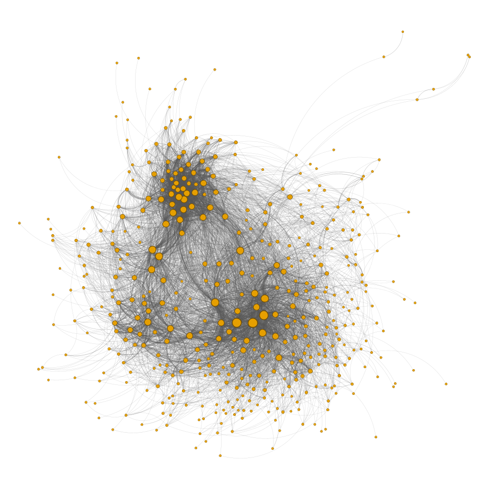

# Detección de Anomalías no Supervisada en Redes Sociales Atribuidas mediante Graph Autoencoders

<p align="center">
  
</p>

> **Trabajo de Fin de Máster** — Máster Universitario en Ciencia de Datos (ETSE-UV)
> Dataset: [Nashville Meetup Network](https://www.kaggle.com/datasets/stkbailey/nashville-meetup) (Meetup Tennessee)
> Modelos: **DOMINANT** (Ding et al., SDM 2019) y **GAD-NR** (Roy et al., WSDM 2024), vía [PyGOD 1.1.0](https://docs.pygod.org/)
> Framework: PyTorch Geometric · PyTorch · NetworkX

---

## Índice

1. [Descripción del proyecto](#1-descripción-del-proyecto)
2. [Objetivo del TFM](#2-objetivo-del-tfm)
3. [Cómo se detectan anomalías: DOMINANT y GAD-NR](#3-cómo-se-detectan-anomalías-dominant-y-gad-nr)
4. [Dataset](#4-dataset)
5. [Estructura del repositorio](#5-estructura-del-repositorio)
6. [Notebooks — guía completa](#6-notebooks--guía-completa)
7. [Instalación y entorno](#7-instalación-y-entorno)
8. [Pipeline de ejecución](#8-pipeline-de-ejecución)
9. [Convenciones del proyecto](#9-convenciones-del-proyecto)
10. [Estado actual](#10-estado-actual)

---

## 1. Descripción del proyecto

Este TFM aplica dos arquitecturas de **Graph Autoencoder para detección de anomalías** — **DOMINANT** y **GAD-NR** — sobre la red social de Meetup de Tennessee, con el objetivo de identificar nodos estructural o atributivamente atípicos **sin ningún tipo de etiqueta de anomalía**. El dataset recoge las interacciones entre miembros, grupos y eventos de meetup.com en Nashville durante 2015–2017.

La red se modela como **tres grafos complementarios**, cada uno capturando una dimensión distinta de la misma realidad social:

| Grafo | Nodos | Aristas | Features/nodo | Semántica del peso |
|---|---|---|---|---|
| **M** — Miembros | 11.371 | 1.176.024 | 3 (geográficas) | Grupos compartidos entre dos miembros |
| **G** — Grupos | 456 | 6.692 | 35 (categoría, tamaño, actividad) | Miembros compartidos entre dos grupos |
| **MG** — Bipartito | 25.233 | 45.583 | 38 (heterogéneo con *zero-padding*) | Eventos asistidos por un miembro en un grupo |

Sobre cada uno de estos grafos se entrena **un modelo DOMINANT y un modelo GAD-NR independientes** — seis experimentos en total —, y los nodos con mayor error de reconstrucción se identifican como candidatos a anomalía. La evaluación es exclusivamente cualitativa: no existe *ground truth* etiquetado, así que los resultados de los modelos se contrastan contra un catálogo de candidatos definido de antemano mediante un análisis exploratorio (EDA) exhaustivo de los tres grafos.

---

## 2. Objetivo del TFM

### 2.1 Objetivo general

Desarrollar y evaluar un *pipeline* de detección de anomalías no supervisada sobre redes sociales atribuidas, comparando DOMINANT y GAD-NR sobre las tres representaciones en grafo del dataset Meetup Tennessee, y analizando cualitativamente los resultados contra candidatos a anomalía identificados en el análisis exploratorio previo.

### 2.2 Objetivos específicos

1. **Caracterizar el dataset.** Análisis exploratorio tabular y estructural que identifique y clasifique candidatos a anomalía — estructural, de atributo y mixta — en las tres representaciones en grafo.
2. **Preparar los datos para los modelos.** Construir, a partir de los metadatos originales, las matrices de *features* de cada grafo.
3. **Implementar y entrenar los modelos.** Aplicar DOMINANT y GAD-NR sobre los tres grafos.
4. **Analizar las señales de anomalía de cada modelo.** Extraer y estudiar por separado las señales de cada arquitectura en vez de limitarse al *score* compuesto.
5. **Comparar ambos modelos entre sí.** Sin el objetivo de declarar un modelo ganador, sino de entender qué aporta cada arquitectura.
6. **Validar los resultados frente al análisis exploratorio.** Contrastar lo detectado con los candidatos del EDA y valorar la complementariedad entre representaciones.
7. **Documentar las limitaciones del trabajo.** Del dataset, de los modelos y de su implementación concreta.

### 2.3 Tipos de anomalía considerados

| Tipo | Descripción | Señales relevantes |
|---|---|---|
| **Estructural** | Patrón de conexión atípico (super-conectores, nodos hoja, puentes inter-comunidad) | `dom_struct`, `gadnr_deg` |
| **De atributo** | *Features* de nodo incoherentes con el resto de la red (miembros internacionales, grupos fantasma) | `dom_attr`, `gadnr_feat` |
| **Mixta / *joint-type*** | Incoherencia entre estructura y atributos, solo detectable considerando ambas a la vez | `gadnr_h` (sin equivalente en DOMINANT) |

---

## 3. Cómo se detectan anomalías: DOMINANT y GAD-NR

### 3.1 Intuición general

Ambos modelos comparten el mismo paradigma: un *encoder* GNN comprime cada nodo en un embedding a partir de su vecindario, y un *decoder* intenta reconstruir algo a partir de ese embedding (aristas, *features*, o la distribución del vecindario). Los nodos **normales** son fáciles de reconstruir (error bajo); los nodos **anómalos** — cuyo patrón de conexión o de atributos difiere del resto de la red — son difíciles de reconstruir (error alto). Ese error de reconstrucción actúa directamente como *anomaly score*.

Difieren en **qué** reconstruye el *decoder*, y eso es lo que determina qué tipo de anomalía detecta cada uno.

### 3.2 DOMINANT

*Encoder* GCN compartido + **dos *decoders* independientes**:

- **Decoder estructural** — reconstruye la matriz de adyacencia mediante producto interno de embeddings: `Â = σ(Z·Zᵀ)`.
- **Decoder de atributos** — reconstruye la matriz de *features* original `X̂` mediante una segunda GCN.

El *score* compuesto es una combinación convexa `s = (1-α)·s_struct + α·s_attr`, con `α` distinto por grafo (0,2 en M, 0,5 en G y MG, según la riqueza de *features* disponible). Los *sub-scores* `dom_struct` y `dom_attr` se extraen por separado para preservar la distinción entre tipo de anomalía.

### 3.3 GAD-NR

En vez de reconstruir aristas individuales, GAD-NR reconstruye la **distribución completa del vecindario** de cada nodo a partir de tres señales:

- **`gadnr_h`** — divergencia KL entre la distribución real y la reconstruida del vecindario (señal *joint-type*, sin equivalente en DOMINANT).
- **`gadnr_deg`** — error de reconstrucción del grado del nodo.
- **`gadnr_feat`** — error de reconstrucción de las *features* del vecindario.

**Limitación documentada:** PyGOD 1.1.0 implementa un *curriculum* interno que reescala dinámicamente los pesos $\lambda_x$ (features) y $\lambda_d$ (grado) hacia un punto fijo, con independencia de los valores declarados por el usuario. Solo $\lambda_n$ (vecindario) permanece bajo control efectivo. Se ha revisado el código fuente de PyGOD 1.1.0 y no existe ningún parámetro para desactivar este mecanismo.

### 3.4 Hiperparámetros comunes

| Hiperparámetro | DOMINANT | GAD-NR |
|---|---|---|
| Dimensión del embedding | 64 | 64 |
| Épocas | 300 | 300 |
| Optimizador | Adam | Adam |
| Learning rate | 0,004 | 0,004 (M) / 0,001 (G, MG) |
| Batch | full batch | full batch |
| Umbral de anomalía | Percentil 95 | Percentil 95 |

`sample_size` de GAD-NR: 4 en M y G, 2 en MG (para controlar el coste de muestreo en el grafo más grande).

### 3.5 *Workarounds* aplicados sobre PyGOD 1.1.0

Durante la implementación se identificaron y parchearon en tiempo de ejecución dos *bugs* de la librería, específicos de GAD-NR:

1. **`tot_nodes` incompatible con PyG ≥ 2.5** — `GADNR.init_model()` pasa un argumento que `GCNConv` ya no acepta; se sobreescribe el método para filtrarlo.
2. **Desajuste de dispositivo en GPU** — `neighbor_num_list` permanece en CPU mientras el resto del modelo está en CUDA; se sobreescribe `forward_model` para forzar el dispositivo correcto.

---

## 4. Dataset

**Fuente:** [Kaggle — Nashville Meetup Network](https://www.kaggle.com/datasets/stkbailey/nashville-meetup) (`stkbailey/nashville-meetup`)

Actividad de meetup.com en Tennessee entre noviembre de 2015 y octubre de 2017.

### Archivos de aristas

| Archivo | Descripción |
|---|---|
| `member-edges.csv` | Pares de miembros con co-membresía. Columnas: `member1`, `member2`, `weight` |
| `group-edges.csv` | Pares de grupos que comparten miembros. Columnas: `group1`, `group2`, `weight` |
| `member-to-group-edges.csv` | Membresías miembro-grupo con actividad. Columnas: `member_id`, `group_id`, `weight` |

### Archivos de metadatos (nodos)

| Archivo | Descripción |
|---|---|
| `meta-members.csv` | 24.591 miembros con nombre, ciudad, estado, coordenadas |
| `meta-groups.csv` | 602 grupos con nombre, categoría, número de miembros, organizador |
| `meta-events.csv` | 19.307 eventos con grupo, nombre y *timestamp* |

### Estadísticas clave

| Métrica | Valor |
|---|---|
| Miembros únicos | 24.591 |
| Grupos únicos | 602 |
| Categorías temáticas | 31 |
| Eventos | 19.307 |
| Ventana temporal | Nov 2015 – Oct 2017 |
| Ciudad principal | Nashville, TN (60,1% de miembros) |
| Grupo más grande | Nashville Hiking Meetup (15.838 miembros) |

---

## 5. Estructura del repositorio

```
TFM/
│
├── README.md
├── requirements.txt
│
├── data/
│   ├── metadata/
│   │   ├── raw/                      ← CSVs originales de Kaggle (ignorado en git)
│   │   └── processed/                ← CSVs limpios, output del notebook 01 (ignorado en git)
│   ├── graphs/
│   │   ├── graph_data/               ← Objetos PyG .pt, output del notebook 04: data_M.pt, data_G.pt, data_MG.pt
│   │   ├── graphml/                  ← Exports GraphML por grafo (member_graph, group_graph, bipartite_graph…)
│   │   └── graphml_cluster/          ← Exports GraphML con anotación de comunidades (Louvain/Greedy Modularity)
│   └── map/                          ← Shapefile Natural Earth, contorno de EE.UU. usado en los mapas geográficos
│
├── notebooks/
│   ├── 01_data_loading_and_preprocessing.ipynb
│   ├── 02_eda_metadata.ipynb
│   ├── 03_eda_graph.ipynb
│   ├── 04_feature_engineering.ipynb
│   ├── 05_dominant_gadnr_grafo_M.ipynb    ← Entrenamiento y evaluación sobre el grafo M
│   ├── 06_dominant_gadnr_grafo_G.ipynb    ← Entrenamiento y evaluación sobre el grafo G
│   └── 07_dominant_gadnr_grafo_MG.ipynb   ← Entrenamiento y evaluación sobre el grafo MG
│
├── images/
│   ├── figures/                      ← Gráficos de EDA y resultados (02_*, 03_*, 05_*, 06_*, 07_*), PNG 300 DPI
│   └── graphs/                       ← Visualizaciones de los grafos completos (PNG/SVG/PDF)
│
├── scripts/
│   └── export_graphml.py             ← Regenera los GraphML de data/graphs/ a partir de los CSVs procesados
│
└── src/
    └── utils/
        └── visualization.py          ← apply_theme, polish, save_figure, paleta y estilos compartidos
```

---

## 6. Notebooks — guía completa

#### `01_data_loading_and_preprocessing.ipynb`
Ingesta desde Kaggle (`kagglehub`), inspección de tipos/duplicados/nulos, eliminación de `hometown` (79,96% de nulos, imputación inviable). **Output:** `data/processed/*.csv`.

#### `02_eda_metadata.ipynb`
Análisis exploratorio tabular: distribución geográfica y calidad de datos de `meta_members` (94 internacionales, 20 estados inválidos, 28,9% de coordenadas de centroide, y un clúster de 180 miembros en California concentrado en grupos Tech de la Bahía de San Francisco); distribución por categoría e integridad referencial de `meta_groups`; distribución temporal y truncamiento por API en `meta_events`.

#### `03_eda_graphs.ipynb`
Análisis estructural de los tres grafos con NetworkX: distribución de grado, centralidades, *clustering*, comunidades (Louvain vs. Greedy Modularity), análisis de pesos y nodos puente. Este *notebook* produce el catálogo de candidatos a anomalía usado como referencia cualitativa en la validación de los modelos.

#### `04_feature_engineering.ipynb`
Construcción de las matrices `X`: `location_level` + `lat`/`lon` para miembros; `log_num_members`, `log_num_events`, `is_truncated`, `has_valid_organizer` + *one-hot* de `category_name` (31 categorías) para grupos; *zero-padding* para el bipartito. Normalización con `StandardScaler` sobre las *features* continuas. **Output:** `data_M.pt`, `data_G.pt`, `data_MG.pt`.

#### `05_dominant_gadnr.ipynb` *(a confirmar nombre/organización real)*
Entrenamiento de los seis experimentos (DOMINANT y GAD-NR sobre M, G y MG), extracción manual de *sub-scores* por *forward pass* (`double_recon_loss` para DOMINANT, `loss_func` para GAD-NR), aplicación de los dos *workarounds* de PyGOD 1.1.0, clasificación por tipo de anomalía (percentil 95) y validación cualitativa contra los candidatos del EDA. **Output:** `results/scores/scores_M.csv`, `scores_G.csv`, `scores_MG.csv`.

---

## 7. Instalación y entorno

### Requisitos del sistema

- Python 3.12
- CUDA 12.1 (GPU recomendada; el grafo M —más de un millón de aristas— es lento en CPU)
- Conda (recomendado) o pip

### Instalación con Conda

```bash
git clone https://github.com/rosique3/Graph-Anomaly-Detection.git
cd Graph-Anomaly-Detection
conda env create -f environment.yml
conda activate TFM_grafos_V2
```

### Instalación manual con pip

```bash
pip install torch>=2.0 --index-url https://download.pytorch.org/whl/cu121
pip install torch-geometric
pip install pygod>=1.1.0
pip install networkx pandas numpy scikit-learn matplotlib seaborn kagglehub
```

> **Nota:** `pygod==1.1.0` es la versión exacta usada en el TFM y la que exhibe el comportamiento de re-ponderación de $\lambda$ documentado en el Capítulo 6. Versiones posteriores podrían corregirlo.

### Credenciales de Kaggle

El notebook 01 descarga el dataset automáticamente vía `kagglehub`:

```bash
# Descargar kaggle.json desde https://www.kaggle.com/settings → API → Create New Token
mkdir -p ~/.kaggle
mv kaggle.json ~/.kaggle/
chmod 600 ~/.kaggle/kaggle.json
```

---

## 8. Pipeline de ejecución

```
01_data_loading        →   data/processed/*.csv
       ↓
02_eda_metadata         →   docs/eda_metadata.md
       ↓
03_eda_graphs            →   docs/eda_grafos.md, catálogo de candidatos
       ↓
04_feature_engineering   →   data/graph_data/data_{M,G,MG}.pt
       ↓
05_dominant_gadnr        →   results/scores/scores_{M,G,MG}.csv
```

**Tiempos de entrenamiento medidos** (GPU NVIDIA RTX 4060 Laptop, 8 GB, 300 épocas):

| Experimento | Nodos | Aristas | s/época | Total |
|---|---|---|---|---|
| DOMINANT — M | 11.371 | 1.176.024 | 0,26 | ≈ 78 s |
| DOMINANT — G | 456 | 6.692 | 0,01 | ≈ 3 s |
| DOMINANT — MG | 25.233 | 45.583 | 1,82 | ≈ 9 min |
| GAD-NR — M | 11.371 | 1.176.024 | 2,20 | ≈ 11 min |
| GAD-NR — G | 456 | 6.692 | 0,08 | ≈ 24 s |
| GAD-NR — MG | 25.233 | 45.583 | 8,25 | ≈ 41 min |

GAD-NR es entre 8 y 10 veces más lento que DOMINANT en los tres grafos — consecuencia de la reconstrucción explícita de la distribución del vecindario, no una contradicción con su mejor complejidad *asintótica* teórica (que solo se manifestaría en grafos bastante más grandes que los de este trabajo).

---

## 9. Convenciones del proyecto

### Nomenclatura de DataFrames

| Variable | Contenido |
|---|---|
| `meta_members` | Metadatos de los 24.591 miembros |
| `meta_groups` | Metadatos de los 602 grupos |
| `meta_events` | Los 19.307 eventos |
| `member_edges` | Las 1.176.368 aristas del grafo M |
| `group_edges` | Las 6.692 aristas del grafo G |
| `member_group_edges` | Las 45.583 aristas del grafo MG |

### Nomenclatura de grafos

| Variable | Descripción |
|---|---|
| `M`, `G`, `MG` | Grafos NetworkX |
| `data_M`, `data_G`, `data_MG` | Objetos `torch_geometric.data.Data` |

### Prefijos de nodos en el bipartito

- Nodos miembro: `member_<member_id>` (ej. `member_2069`)
- Nodos grupo: `group_<group_id>` (ej. `group_339011`)

### Columnas de `results/scores/scores_*.csv`

```
dom_struct, dom_attr, dom_combined      # señales de DOMINANT
gadnr_h, gadnr_deg, gadnr_feat, gadnr_score   # señales de GAD-NR
pct_dom_struct, pct_dom_attr, ...       # percentiles de cada señal
type_dom, type_gadnr                    # tipología (Normal/Estructural/Atributo/Mixta) por modelo
```

### Estructura del objeto `Data` de PyG

```python
data_M.x            # Tensor [num_nodes, num_features]
data_M.edge_index   # Tensor [2, num_edges*2] — ambas direcciones
data_M.edge_weight  # Tensor [num_edges*2]
data_M.member_ids   # Lista de member_ids en el orden del tensor x

data_MG.node_ids    # IDs (member_* y group_*) en orden del tensor x
data_MG.n_members   # Número de nodos miembro (primeros n_members nodos)
data_MG.n_groups    # Número de nodos grupo (últimos n_groups nodos)
```

**Nota:** PyGOD requiere que el objeto `Data` de entrada contenga únicamente `x` y `edge_index` — cualquier atributo adicional (`edge_weight`, `member_ids`...) provoca un `ValueError` en `fit()`. Se construye un objeto `data_clean` sin esos atributos auxiliares justo antes de entrenar, preservando los originales para el análisis posterior.

---

## 10. Estado actual

| Fase | Estado |
|---|---|
| Carga y preprocesamiento | ✅ Completado |
| EDA tabular | ✅ Completado |
| EDA de grafos | ✅ Completado |
| Feature engineering | ✅ Completado |
| Entrenamiento DOMINANT (M, G, MG) | ✅ Completado |
| Entrenamiento GAD-NR (M, G, MG) | ✅ Completado |
| Validación cualitativa contra el EDA | ✅ Completado |
| Redacción de la memoria | ✅ Completado |

---

## Referencias principales

- Ding, K., Li, J., Bhanushali, R., & Liu, H. (2019). *Deep Anomaly Detection on Attributed Networks*. SDM.
- Roy, A., et al. (2024). *GAD-NR: Graph Anomaly Detection via Neighborhood Reconstruction*. WSDM.
- Liu, K., et al. *PyGOD: A Python Library for Graph Outlier Detection*. https://docs.pygod.org/
- Kipf, T. N., & Welling, M. (2017). *Semi-Supervised Classification with Graph Convolutional Networks*. ICLR.

---

*Repositorio del TFM — Detección de anomalías no supervisada en redes sociales atribuidas mediante Graph Autoencoders · Meetup Tennessee*